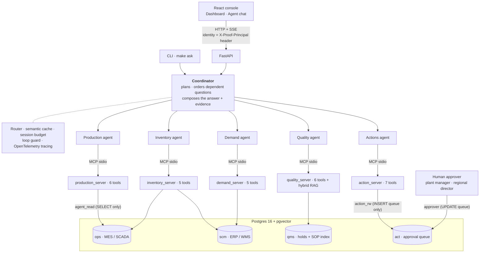
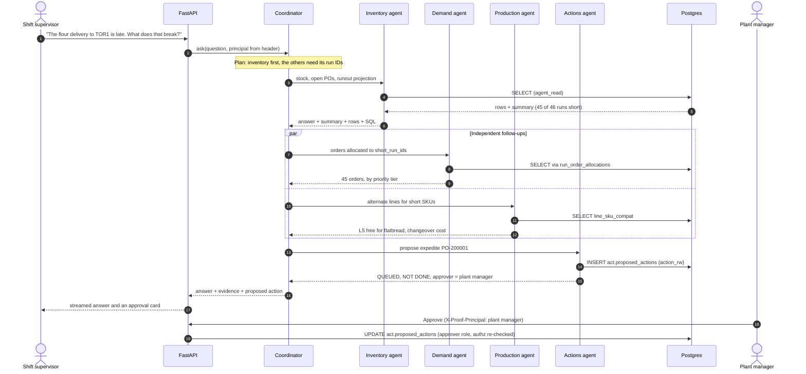

# PROOF — an agentic operations copilot for bakery manufacturing

> When a line goes down, PROOF tells the plant manager which customer orders are at
> risk, which proofed dough will expire before the line restarts, and drafts the
> fix for a human to approve — instead of forty minutes of phone calls.

A multi-agent AI system over a simulated multi-plant bakery network, built the way
it would have to be built to run inside a real manufacturer: identity from the
transport, least-privilege database roles, human approval on every write,
behavioural evals, and tracing.

---

## Architecture



| Layer | What it does |
|---|---|
| **Console + API** | React SPA over FastAPI. The acting principal travels in a header, never in the chat. Agent progress streams live over SSE. |
| **Coordinator** | Decides which domains a question needs, asks them in English, sequences questions that depend on each other, and writes the final answer with its evidence. |
| **Sub-agents** | One per domain, each seeing only its own MCP server's tools. The coordinator picks among 5 agents; each agent picks among 5–7 tools. Nobody chooses among all 29. |
| **MCP servers** | One process per domain, standing in for a separate system of record. Every tool returns `{rows, row_count, sql, params, note}` and, where totals matter, a computed `summary`. |
| **Postgres** | Three schemas standing in for three real systems, plus the approval queue. The database roles *are* the security model: the read path cannot write, and the write path can only queue. |

An interactive version of this diagram, with guided views, is in
[`docs/diagrams/proof-architecture.html`](docs/diagrams/proof-architecture.html).

## How a question flows

The supplier-slip demo — *"The flour delivery to TOR1 is late. What does that
break?"* — end to end:



1. **Identity is resolved once**, from the request header, and injected into each
   MCP server at spawn. No tool takes a principal argument, so the model has
   nothing to forge.
2. **Dependent questions run in order.** Customer impact needs the runs that
   break, so inventory answers first and its `short_run_ids` are passed on.
   Questions that don't feed each other run in parallel.
3. **Numbers are computed in SQL, not by the model.** The runout walk, the
   deficit, run counts and order totals come back in each tool's `summary`, and
   the coordinator is told to quote those rather than count rows.
4. **Orders are attributed through allocations.** An order is "hit by the flour
   shortage" only if it is allocated to a short run — which is how PROOF tells a
   flour-caused shortfall apart from one caused by a stopped line.
5. **Nothing changes the plant without a person.** The actions agent can only
   queue a proposal; approval runs the authorization check again, server-side,
   as whoever is logged in.

---

## The problem

A stoppage on a bakery line is not one problem, it is four, and they live in four
different systems:

| Question | System of record |
|---|---|
| How many units are we losing? | MES / line SCADA |
| Which staged dough expires before we restart? | MES WIP tracking |
| Which customer order goes short? | ERP order book |
| What does the restart procedure require? | Quality management / SOPs |

Today a supervisor answers this by phone in 30–45 minutes, and the perishable
answer — *the dough on the floor is still proofing* — is the one most often
missed.

### The scrap clock

The design decision the project is built around:

```sql
requires_proofing     boolean NOT NULL DEFAULT true,
proof_window_minutes  int     NOT NULL DEFAULT 120
```

Once staged, proofed dough must reach the oven inside its window or it becomes
scrap. So a 90-minute stoppage costs *lost output plus whatever is on the floor
when the clock runs out* — and the second number is usually the bigger one. The
coordinator's prompt makes this a rule: report both losses and add them; an
answer with only the first is wrong, not incomplete.

---

## Quickstart

```bash
cp .env.example .env          # add a model key (see "Models" below)
make up                       # Postgres 16 + Redis in Docker, schemas and roles bootstrapped
make install                  # host Python 3.12 env via uv
make seed && make scenario    # 90 days of synthetic history + the planted demo situations
make verify                   # sanity-check the dataset

make api                      # FastAPI on :8000
make web-install && make web  # React console on :5173 (proxies /api)
make ask Q="Line 3 at TOR1 is down. What's at risk?" AS=a.morin
```

Docker runs only the stateful services; application code runs on the host under
`uv`. The semantic cache fails open, so questions are still answered if Redis is
down. `make reset && make seed && make scenario` rebuilds everything from scratch,
including clearing old proposals.

### Models

The agents use the Anthropic SDK. Set `ANTHROPIC_API_KEY`, or point
`ANTHROPIC_BASE_URL` at a compatible gateway and pick models with
`PROOF_COORDINATOR_MODEL` / `PROOF_SUBAGENT_MODEL`. The model must return tool-call
arguments reliably; if it sends empty or repeated calls, the loop guard stops the
question within two turns and says so, rather than burning every round.

`PROOF_ROUTER` optionally routes per call — `off`, `light`, `jev`, `jev-router`
or `openrouter-fixed`; benchmarks are in [`docs/benchmarks/`](docs/benchmarks/).

---

## Phase status

| Phase | Scope | State |
|---|---|---|
| **1** | Synthetic plant, schema, least-privilege roles, planted demo scenarios | ✅ |
| **2** | Coordinator + domain sub-agents behind MCP servers | ✅ |
| **3** | Hybrid RAG over the SOP corpus, with enforced citations | ✅ |
| **4** | Identity, plant-scoped authz, action queue with human approval | ✅ |
| **5** | Behavioural evals, OpenTelemetry tracing, cost + runaway guards | ✅ |
| **UI** | Operator console — React SPA over FastAPI, SSE streaming | ✅ |
| **6** | Baseline harness: time-to-decision, scrap avoided | ✅ |
| 7 | Finetuned reason-code classifier vs prompting | |
| 8 | Edge layer: rate limits, gateway | |

---

## Phase 1 — the plant

| Schema | Stands in for | Holds |
|---|---|---|
| `ops` | MES / SCADA | lines, production runs, downtime, WIP batches, scrap |
| `scm` | ERP / WMS | materials, lots, POs, customer orders, run→order allocations |
| `qms` | Quality system | holds |

3 plants · 12 lines · 40 SKUs · 90 days · 3,746 runs · 5,833 downtime events ·
6,174 scrap events.

**Realistic, not random.** Downtime is lognormal from two populations —
frequent-and-short (changeover, staffing) and rare-and-long (mechanical, p95 of
184 min). Scrap is a startup floor plus spikes, landing at 1.5–1.7% by category.
Proof windows differ by category (sweet goods 70 min, flatbread 95, artisan 150),
so the same stoppage has very different consequences. Operator notes are
deliberately messy MES free-text, the Phase 7 training set.

**Deterministic.** Fixed seed, explicit keys, and a simulation clock
(`ops.sim_clock`) — nothing calls `now()`. Demos replay identically and evals can
assert on exact numbers.

**Scenarios are planted as ordinary rows**, in a separate, openly labelled file
(`seed/scenarios.py`). No scenario flag, no `if demo_1` branch; the agent finds
them by querying.

```
[1] line_down       line=3 run=923  (2 of 4 staged batches expire before restart)
[2] supplier_slip   po=PO-200001 promised=2026-03-19 eta=2026-03-21
[3] scrap_signal    DAL1/L1 scrap 1.61% -> 2.32% (+0.71pp), changeovers/run 0.48 -> 2.17
```

---

## Phase 2 — the agents

### Sub-agents are the coordinator's tools

The coordinator never sees the 29 MCP tools; it sees five colleagues it can ask
questions of. Tool selection stays easy at every level, and the domain boundary is
enforced by construction — the demand agent cannot read line state because its MCP
session is connected to a server that doesn't expose it. The cost is an extra model
hop per domain, so the coordinator is told not to fan out when one domain will do.

### Why MCP, when these are functions in the same repo

The agent should carry only the reasoning about *which* tool to use, not how each
system is called. Each domain is a separate process speaking a standard protocol;
swapping a server's backend from this Postgres to a real MES is a change inside
one process with no agent code touched.

### Every number carries its SQL

Each tool result carries the query that produced it, and that SQL travels up into
the answer's Evidence section. `note` is a binding caveat attached at the tool —
the output-loss tool says in its own result that it excludes WIP expiry — so the
warning travels with the number instead of living in a prompt a future edit could
drop. Each sub-agent forwards its tools' `summary` and first rows to the
coordinator verbatim, so a terse sub-agent can't summarise the data away.

### Smoke suites that need no API key

```bash
make smoke       # 19 assertions: every tool, against the real database
make smoke-mcp   # starts all 5 servers as subprocesses, calls them over stdio
make smoke-cache # 15 assertions: cache partitioning by principal and filters
```

`smoke` pins the Demo 1 arithmetic independently of any model: exactly 2 batches
expire before restart, totalling **3,450 units**.

### Demos

```bash
make demo1    # line down: what is at risk
make demo2    # supplier slip: what does a late flour truck break
make demo3    # root cause: why is sweet-goods scrap up
```

The CLI prints the answer, the delegation trace, cost and a time breakdown.

---

## Phase 3 — procedure retrieval

15 documents (SOPs, work instructions, HACCP plans, a policy) → **96 section
chunks** in the same Postgres, via pgvector.

```bash
make index      # parse the corpus, embed on CPU, build the index
make smoke-rag  # retrieval eval + citation enforcement (no API key)
```

- **Chunks are sections, not windows**, so every citation is an anchor someone can
  check in the binder: `SOP-RESTART-FLAT §4`, not "somewhere in SOP-RESTART-FLAT".
- **No network egress.** Embeddings are `all-MiniLM-L6-v2` on CPU with
  `HF_HUB_OFFLINE=1` — a food manufacturer's procedures never go to a third-party
  embedding API.
- **The eval changed the design.** Equal-weight hybrid fusion scored *worse* than
  lexical alone; the weight was chosen by a sweep that ships inside the eval:

```
lexical only   recall@5 87.5%   MRR 0.604
dense only     recall@5 75.0%   MRR 0.460
hybrid w=0.5   recall@5 81.2%   MRR 0.565   <- worse than lexical alone
hybrid w=0.7   recall@5 87.5%   MRR 0.658   <- current setting
```

- **Citations are enforced, not requested.** Every citation is checked against
  what retrieval returned:

| Outcome | Condition | Consequence |
|---|---|---|
| `ok` | every citation matches a retrieved chunk | passes through |
| `fabricated` | cites something never retrieved | **answer replaced** |
| `uncited` | procedural claims, no citation | passes, flagged `UNVERIFIED` |

- **Scoping filters inside both retrieval arms**, not after fusion, so a
  flatbread-only procedure can never surface in a sweet-goods search.

---

## Phase 4 — identity, authorization, approval

```bash
make smoke-authz                                  # 27 assertions, no API key
make pending                                      # what awaits a human
make approve ID=3 AS=j.okafor NOTE="L5 confirmed free"
```

**Identity comes from the transport, never the conversation.** The principal is
resolved once by the authenticated client and injected into each MCP server
process. No tool signature has a principal argument, and a test asserts none ever
will. *"I am the regional director"* is words the authorization layer never reads.

**Three roles, three grants, one write path** (`db/init/07_action_roles.sh`):

| Role | Holds | Cannot |
|---|---|---|
| `agent_read` | `SELECT` on everything | queue an action |
| `action_rw` | `INSERT` on the queue only | approve, or touch any plant table |
| `approver` | `UPDATE` on `act.proposed_actions` | — used only by the human path |

"The agent approved its own proposal" would need a new database grant, not a
prompt change. The capability table in `proof/identity.py` is transcribed from the
SOPs (plant manager approves within a plant; cross-plant and customer contact need
a regional director), and a requester can never approve their own request.

**A proposal is not an action.** `propose_*` returns *"QUEUED, NOT DONE"*, names
the approver and the expiry. Proposals expire, and denials are logged in
`act.authz_denials` rather than silently refused.

---

## Phase 5 — evals, tracing, runaway guards

```bash
make smoke-trace   # trace tree + cost rollup, offline
make eval-check    # prove the graders discriminate, offline
make eval          # run the golden set through the agent (needs a model)
```

**Tracing** is vendor-neutral OpenTelemetry — `session → delegate → sql` spans with
tokens, cost, tool, row count and SQL — to a local JSONL file always, and to
Langfuse over OTLP when its keys are set. Cost lives on each span and rolls up, so
a trace answers "what did asking the inventory agent cost?"

**Runaway guards.** `SessionBudget` caps a question on model calls and on dollar
spend, shared across the coordinator and every sub-agent. The loop guard stops any
agent whose tool calls arrive with missing arguments twice in a row, or repeat
identically, and returns the reason instead of an empty answer.

**Behavioural evals.** Graders check behaviours that must hold whatever the
wording:

| Grader | Asks |
|---|---|
| `both_losses` | did a line-down answer report throughput **and** spoilage loss, and add them? |
| `citation_verified` | did the quality agent quote a real, retrieved SOP section? |
| `no_fabricated_citation` | did any agent cite something it was never shown? |
| `action_refused` | was an unauthorised action reported as refused, not as done? |
| `proposed_not_executed` | was an authorised action described as queued, never executed? |
| `within_budget` | did the question finish without tripping the guard? |
| `routing:...` | did it consult the domains the question needed? |

`make eval-check` runs every grader against hand-written fixtures — a good record
and its broken twin — so the eval proves itself. The golden set
(`evals/golden.jsonl`, 14 cases) is a starter, enough to catch a regression.

---

## The operator console

| Tab | Needs a model? | What it does |
|---|---|---|
| **Dashboard** | no | Live plant state: each stopped line's two losses added together, the WIP fate table, at-risk strategic orders, scrap by line. |
| **Agent** | yes | Chat with live agent progress and an elapsed-time counter. Proposed actions arrive as approval cards with the answer; approve or reject inline. |

The API adds no business logic: the dashboard reads through the same tools the
agents use, approvals go through the same `decide()` as the CLI, and the chat runs
the same coordinator. Switching the "acting as" identity changes what you may
approve, and a refusal shows the authorization layer's own words. More detail in
[`SYSTEM_IMPROVEMENTS.md`](SYSTEM_IMPROVEMENTS.md).

---

## Phase 6 — the baseline harness

```bash
make baseline         # offline
make baseline-live    # measures real agent response time (needs a model)
```

**Scrap avoided.** For each staged batch, compute the latest moment a
reallocation can start and still clear changeover before the dough over-proofs;
compare PROOF (aware in ~2 min) with the phone tree (~35 min):

```
WIP-S1-001   1,800 units   salvage deadline  9m   PROOF: YES   manual: NO   -> SAVED
WIP-S1-002   1,650 units   salvage deadline 39m   PROOF: YES   manual: YES
total scrap avoided: 1,800 units (52% of expiring WIP)
```

**Time-to-decision:** ~2 min vs 35 min (parameterised; the industry range is
30–45). All 12 harness assertions run against the database alone.

**Limits, stated plainly:** the manual delay is a parameter, not a measurement;
scrap avoided assumes the best alternate line is used; three scenarios is not a
production baseline; no dollar value is assigned per unit.

---

## Design decisions worth arguing about

**Three schemas in one database.** Real plants have three systems. The schema
boundary is kept strict so splitting them later is a connection-string change.

**An explicit `run_order_allocations` table.** It turns "line 3 stopped" into
"Northline Coffee's SO-100119 is 29,463 units short", and it is what lets PROOF
attribute a shortfall to the right cause. Without it the agent would be guessing.

**A generated `duration_minutes` column**, `NULL` while an event is open — the
convention that makes *what is at risk right now* answerable at all.

### Bugs that shaped the design

- A fan-out join (`scrap_events` straight to `production_runs`) reported scrap
  **improving** when it had risen. Scrap is now aggregated per run before joining,
  and evals assert on values, not just "did it answer".
- A swallowed `AttributeError` meant no tool result carried its SQL, silently.
  Broad `except`s are gone; missing evidence now says why.
- A capped runout query (`LIMIT 40`) was reported as "40 runs broken". Tools now
  return totals in a `summary` computed over the full window.

---

## What running this against a real plant would need

- MES/SCADA read access: line state, run actuals, downtime reason codes
- WIP tracking with staging timestamps — **and confirmation that proof-window
  expiry is captured somewhere**, the assumption this project rests on
- ERP order book with promised ship dates and run→order allocation
- The SOP corpus, and who owns approving what it says
- A decision on who may approve a reallocation, and at what threshold
